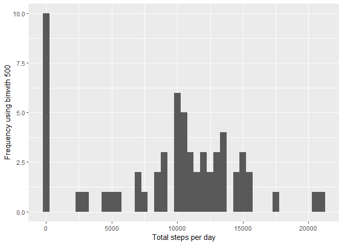
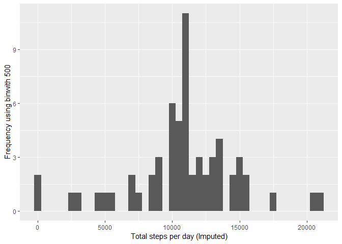

## Loading and preprocessing the data


```r
setwd("C:/Arnab/R/RepData_PeerAssessment1")
if(!file.exists('activity.csv')){
    unzip('activity.zip')
}
activityData <- read.csv('activity.csv')
```

## What is mean total number of steps taken per day?


```r
stepsByDay <- tapply(activityData$steps, activityData$date, sum, na.rm=TRUE)
qplot(stepsByDay, xlab='Total steps per day', ylab='Frequency using binwith 500', binwidth=500)
```

<!-- -->

```r
stepsByDayMean <- mean(stepsByDay)
stepsByDayMedian <- median(stepsByDay)
```
* Mean: 9354.2295082
* Median:  10395

## What is the average daily activity pattern?


```r
averageStepsPerTimeBlock <- aggregate(x=list(meanSteps=activityData$steps), by=list(interval=activityData$interval), FUN=mean, na.rm=TRUE)
ggplot(data=averageStepsPerTimeBlock, aes(x=interval, y=meanSteps)) +
    geom_line() +
    xlab("5-minute interval") +
    ylab("average number of steps taken") 
```

<!-- -->

```r
mostSteps <- which.max(averageStepsPerTimeBlock$meanSteps)
timeMostSteps <-  gsub("([0-9]{1,2})([0-9]{2})", "\\1:\\2", averageStepsPerTimeBlock[mostSteps,'interval'])
```
* Most Steps at: 8:35

## Imputing missing values

```r
numMissingValues <- length(which(is.na(activityData$steps)))
```

Number of missing values: 2304


```r
activityDataImputed <- activityData
activityDataImputed$steps <- impute(activityData$steps, fun=mean)

stepsByDayImputed <- tapply(activityDataImputed$steps, activityDataImputed$date, sum)
qplot(stepsByDayImputed, xlab='Total steps per day (Imputed)', ylab='Frequency using binwith 500', binwidth=500)
```

<!-- -->

```r
stepsByDayMeanImputed <- mean(stepsByDayImputed)
stepsByDayMedianImputed <- median(stepsByDayImputed)
```

* Mean (Imputed): 1.0766189\times 10^{4}
* Median (Imputed):  1.0766189\times 10^{4}

## Are there differences in activity patterns between weekdays and weekends?


```r
activityDataImputed$dateType <-  ifelse(as.POSIXlt(activityDataImputed$date)$wday %in% c(0,6), 'weekend', 'weekday')
averagedActivityDataImputed <- aggregate(steps ~ interval + dateType, data=activityDataImputed, mean)
ggplot(averagedActivityDataImputed, aes(interval, steps)) + 
    geom_line() + 
    facet_grid(dateType ~ .) +
    xlab("5-minute interval") + 
    ylab("avarage number of steps")
```

<!-- -->


